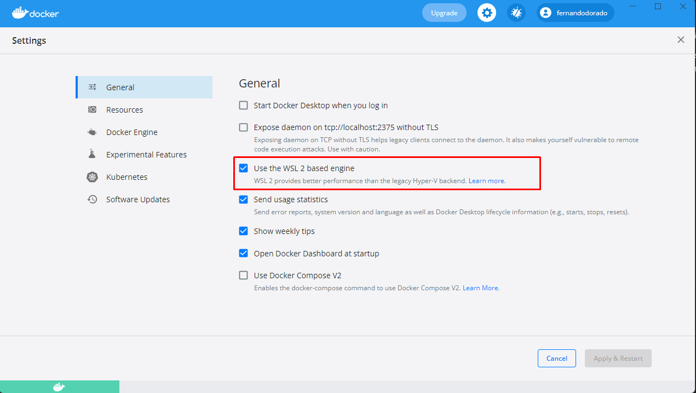
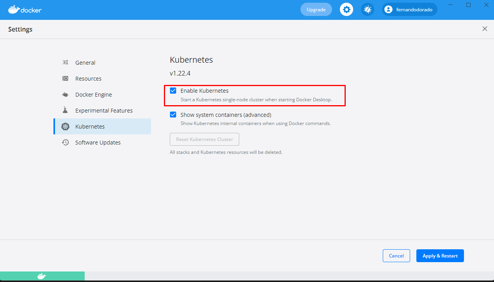
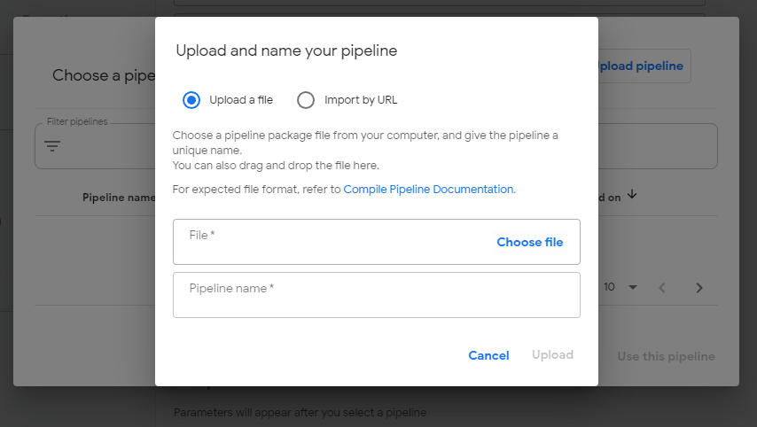
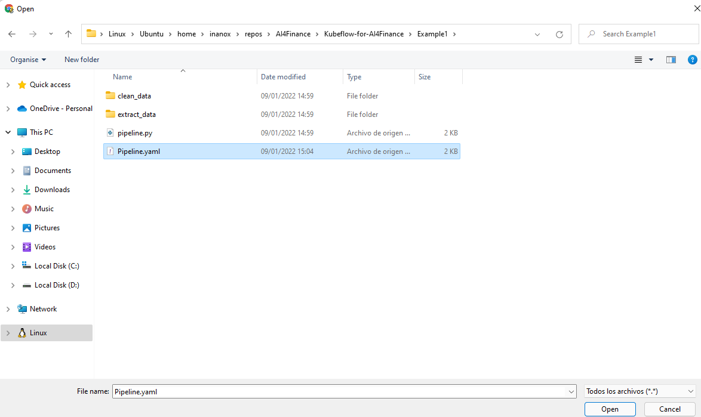
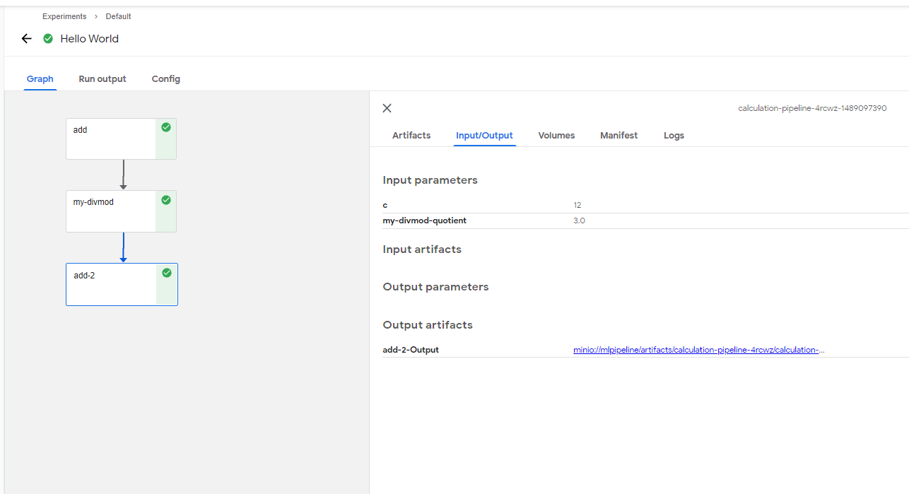
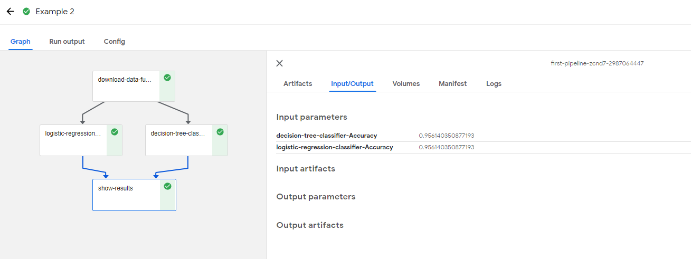

# Kubeflow for AI4Finance

This repository aims to deepen in the concepts related to perform ML pipelines using Kubeflow, showing the necessary instroductions to create a cluster and the launching of a simple example. 

## Instructions to install Kubeflow via WSL2 (Ubuntu on Windows)
### 1. Install WSL2 on windows
[Windows Subsystem for Linux (WSL)](https://docs.microsoft.com/en-us/windows/wsl/compare-versions#whats-new-in-wsl-2) is a compatibility layer for running Linux binary executables (in ELF format) natively on Windows 10, Windows 11, and Windows Server 2019. The Windows Subsystem for Linux (WSL) lets developers run a Linux environment directly on Windows. It’s an unmodified OS, but highly integrated into Windows and without the overhead of a virtual machine. To install WSL2 on Windows10/11 follow the next instructions:

1. Open a Powershell as Admin and introduce the next command:
```bash
wsl --install
```

In theory, this command will install all the required dependencies. In case of problems, visit [this link](https://www.windowscentral.com/how-install-wsl2-windows-10) and follow the detailed instructions. 

### 2. Docker and Kubernetes
The next step consist into install Docker Desktop, lately with full support with WSL2. Using this app, you can easily enable full Kubernettes support, running in your local WSL2 System. The only changes that you need to modify is to mark this options in Docker Desktop:





### 3. Install Kubeflow
Now we are ready to create the required Kubeflow instances in our K8s cluster. The first step that we need is to install **kubectl** in our WSL2 env. Use the Kubernetes command-line tool, kubectl, to deploy and manage applications on Kubernetes. With kubectl, you can inspect cluster resources; create, delete and update components; explore your new cluster; and launch sample applications. Install by introducing the next commands in CMD from WSL2:
```bash
curl -LO https://storage.googleapis.com/kubernetes-release/release/$(curl -s https://storage.googleapis.com/kubernetes-release/release/stable.txt)/bin/linux/amd64/kubectl
```

```bash
chmod +x ./kubectl
```

```bash
sudo mv ./kubectl /usr/local/bin/kubectl
```

Next we copy the local Windows Kubernetes config to our WSL2 environment
```bash
mkdir ~/.kube
cp /mnt/c/Users/{fill_with_yourname_in_Windows}/.kube/config ~/.kube
```
Now we're ready to install Kubeflow. There are [multiples ways](https://www.kubeflow.org/docs/components/pipelines/installation/localcluster-deployment/), I explain here the way that I think that is more straighforward to set up: 
```bash
curl -LO https://github.com/kubeflow/kfctl/releases/download/v1.0.1/kfctl_v1.0.1-0-gf3edb9b_linux.tar.gz
tar -xvf kfctl_v1.0.1-0-gf3edb9b_linux.tar.gz
chmod +x kfctl
sudo mv ./kfctl /usr/local/bin/kfctl
rm kfctl*.tar.gz
```


Next we have to specify some environment variables to define our Kubeflow setup like the Kubeflow name and the location and apply then the YAML for installation.

```bash
export KF_NAME=wsl2-kubeflow
export BASE_DIR="${HOME}/kubeflow/"
export KF_DIR=${BASE_DIR}/${KF_NAME}
export CONFIG_URI="https://raw.githubusercontent.com/kubeflow/manifests/v1.0-branch/kfdef/kfctl_k8s_istio.v1.0.0.yaml"

mkdir -p ${KF_DIR}
cd ${KF_DIR}
kfctl apply -V -f ${CONFIG_URI}
```

In case of some errors, stop the current installation, go to kubeflow folder from WSL2 (home/user/kubeflow/wso2-kubeflow), 
```bash
kfctl delete -V -f kfctl_k8s_istio.v1.0.0.yaml
```
Clean the wsl2-kubeflow folder: 
```bash
sudo rm -r *
```
and introduce the next command again: 
```bash
export KF_NAME=wsl2-kubeflow
export BASE_DIR="${HOME}/kubeflow/"
export KF_DIR=${BASE_DIR}/${KF_NAME}
export CONFIG_URI="https://raw.githubusercontent.com/kubeflow/manifests/v1.0-branch/kfdef/kfctl_k8s_istio.v1.0.0.yaml"

mkdir -p ${KF_DIR}
cd ${KF_DIR}
kfctl apply -V -f ${CONFIG_URI}
```

Lets see where our Kubeflow dashboard is:
```bash
echo "http://localhost:$(kubectl -n istio-system get service istio-ingressgateway -o jsonpath='{.spec.ports[?(@.name=="http2")].nodePort}')"
```

We will get http://localhost:31380, lets try it out, WSL2 will share the IP with our local system:

Check the pods in kubeflow namespace:
```bash
kubectl get pods  -n kubeflow
```

# Generate Pipeline
Now, we can generate a simple pipeline (/*Example1*) using Kubeflow Pipelines SDK (KFP). You can read the instructions to install this package from [this link](https://www.kubeflow.org/docs/components/pipelines/sdk/install-sdk/). Two exaples are provided in the repo. 

To generate the pipeline .yaml, go to Example1 folder and introduce the next command: 
```bash
python pipeline.py
```
Once executed, a Pipeline.yaml file will be generated in the same directory. 

Let's see how we can import this pipeline into Kubeflow:

1. Go to http://localhost:31380/_/pipeline/#/experiments
2. Click on "+ Create run"
3. Choose a pipeline from your local system 



4. Start a experiment adding some arguments


5. Go to the experiment and see the results


In the other exaple, the results have the next format: 


# Additional Resources
1. [Use WSL2 in VScode](https://code.visualstudio.com/blogs/2019/09/03/wsl2) 
2. [kubectl Cheat Sheet](https://kubernetes.io/docs/reference/kubectl/cheatsheet/)